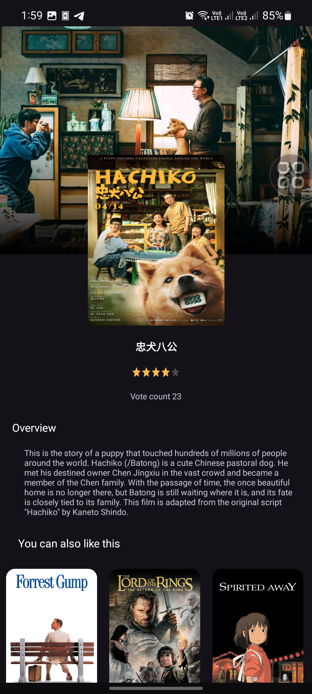

# Demo Movie App

Welcome to the Demo Movie App! This project demonstrates a robust, scalable Android application following clean architecture principles and a multimodule setup.
|  |  |  |
|----------------------------------------------|----------------------------------------------|----------------------------------------------|
|  | |
|----------------------------------------------|----------------------------------------------|----------------------------------------------|


https://github.com/mahmoud947/DemoMovieApp/assets/65209396/f69cf69e-d17f-4a0a-8095-1d58ec9320e4


## Table of Contents

- [Introduction](#introduction)
- [Features](#features)
- [Architecture](#architecture)
- [Modules](#modules)
- [Libraries](#libraries)
- [Setup](#setup)
- [Screenshots](#screenshots)
- [Video](#video)
- [License](#license)

## Introduction

The Demo Movie App is designed to provide users with an engaging experience for browsing and discovering movies. It features a modern Android development stack, ensuring high-quality code, testability, and maintainability.

## Features

- Browse top-rated movies
- Discover upcoming releases
- See what’s playing now
- View the most popular movies
- Pull-to-refresh for the latest data
- Detailed movie information
- Offline support

## Architecture

The app follows Clean Architecture principles, which helps in separating concerns and making the codebase more maintainable and testable. The architecture is divided into three main layers:

1. **Presentation Layer**: Contains UI-related components such as Activities, Fragments, and ViewModels.
2. **Domain Layer**: Contains business logic and use cases.
3. **Data Layer**: Manages data sources, repositories, and models.

This approach ensures that each layer has a clear responsibility and can be developed and tested independently.

## Modules

The project utilizes a multimodule architecture to separate different features and concerns, making the codebase more modular and scalable. Here are the main modules in the project:

- **app**: The main application module.
- **core**: Contains common utility classes and base components used across other modules.
- **domain**: Defines the business logic and use cases.
- **data**: Manages data sources and repositories.

## Libraries

The app leverages several popular libraries to ensure a smooth and efficient development process. Some of the key libraries used are:

- [Hilt](https://dagger.dev/hilt/): For dependency injection.
- [ViewModel](https://developer.android.com/topic/libraries/architecture/viewmodel): To manage UI-related data in a lifecycle-conscious way.
- [LiveData](https://developer.android.com/topic/libraries/architecture/livedata): For observable data holder classes.
- [Retrofit](https://square.github.io/retrofit/): For network requests.
- [Glide](https://bumptech.github.io/glide/): For image loading and caching.
- [Coroutines](https://kotlinlang.org/docs/coroutines-overview.html): For asynchronous programming.
- [easy_connectivity](https://github.com/mahmoud947/easy_connectivity): A custom library for handling network connectivity, built and published on Maven from scratch by me.

### easy_connectivity

I developed the `easy_connectivity` library to simplify the management of network connectivity in Android applications. This library provides a straightforward and efficient way to check network status and handle connectivity changes. It is published on Maven, making it easy to integrate into other projects.

### Work Manager
The app utilizes Work Manager to clear the cache every 4 hours, ensuring optimal performance and storage management.

## Setup

To set up the project locally, follow these steps:

1. Clone the repository:
   ```bash
   git clone https://github.com/mahmoud947/DemoMovieApp.git
2. Open the project in Android Studio.
3. Sync the project with Gradle.
4. Build and run the app on an emulator or physical device.


